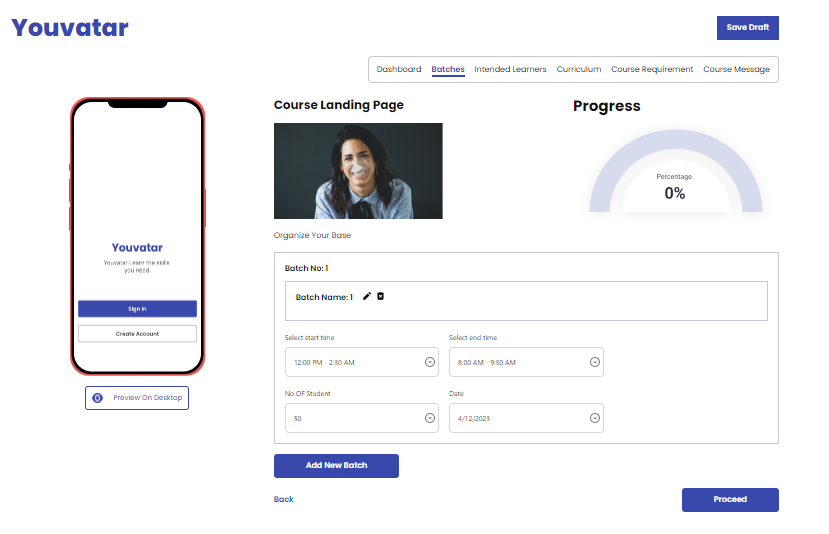

# Youvatar: Your All-in-One Education Dashboard 

Welcome to Youvatar, a minimalist dashboard designed for easy access to your favorite links and resources. With a clean and responsive design, Youvatar Dashboard makes it easy to stay organized and productive.

## Live Website Link 
https://youvatar-imtias.netlify.app/

## Technologies Used
Youvatar Dashboard is built using the following technologies:

**React:** A popular front-end framework for building dynamic user interfaces.

**React Router:** A library that provides dynamic routing for single-page applications.

**Tailwind CSS:** A utility-first CSS framework that makes it easy to style your web pages.
Installation
To install Simple Dashboard on your local machine, follow these steps:

## Installation
To install Simple Dashboard on your local machine, follow these steps:

**1.** Clone this repository to your local machine.

**2.** Navigate to the project directory.

**3.** Run npm install to install the required dependencies.

**4.** Run npm run dev to start the development server.

